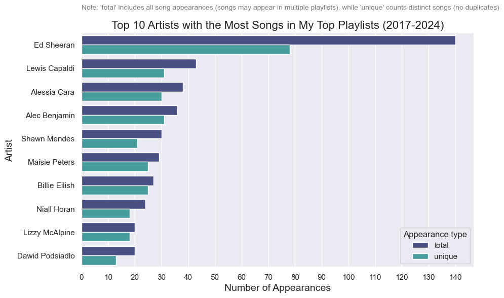
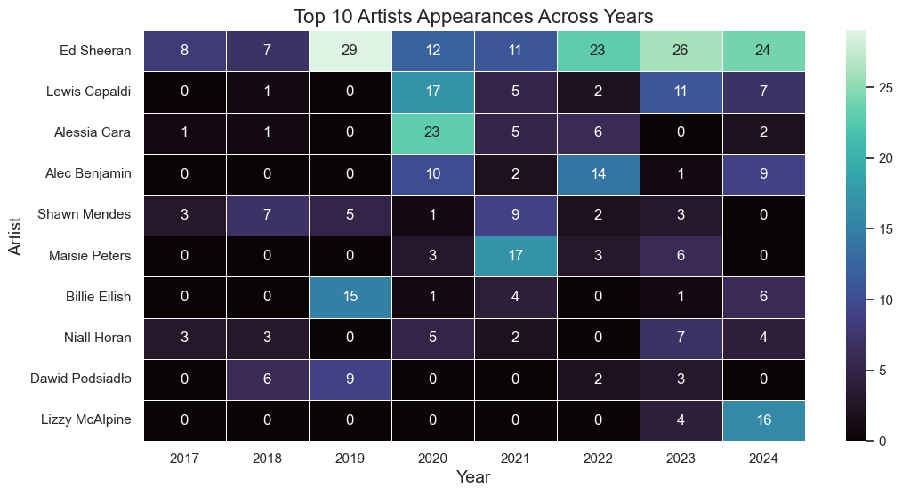
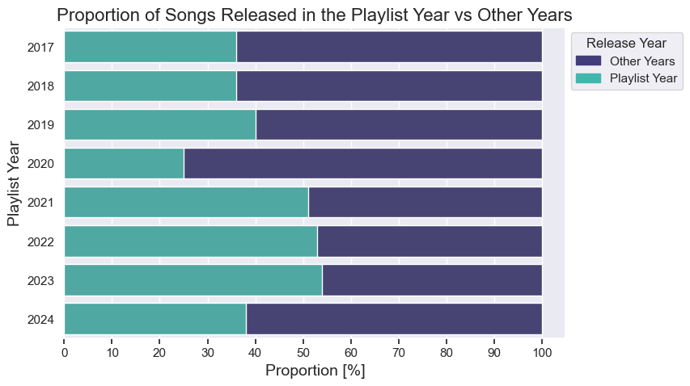

# 🎵 My Spotify Wrapped: Data Exploration & Visualization

This project explores and visualizes my Spotify Wrapped playlists (2017-2024) using the Spotify Web API (Spotipy). The analysis focuses on songs and artists, applying various transformations and visualizations.

## 📊 Features
- Access my Spotify Wrapped playlist data via Spotipy
- Data processing with pandas
- Visualizations using matplotlib and seaborn

## 🛠 Tech Stack
- Python
- Jupyter Notebook
- pandas (data manipulation)
- Spotipy (Spotify Web API)
- matplotlib & seaborn (data visualization)

## 📸 Sample Visualization
### Sample 1
  
  
### Sample 2
  
  
### Sample 3

